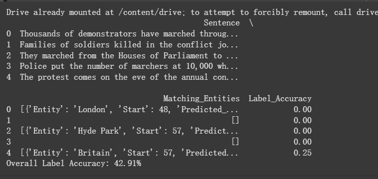
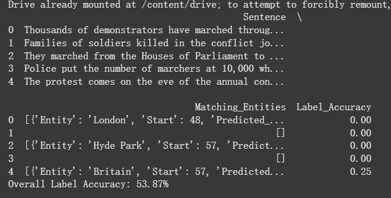
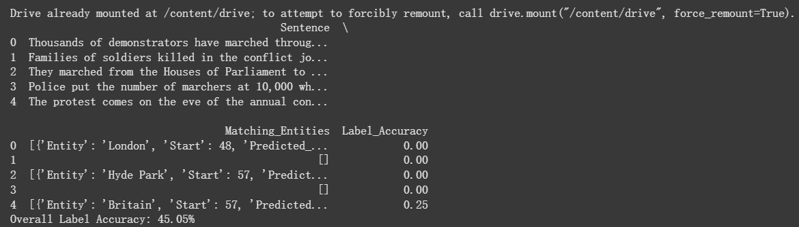
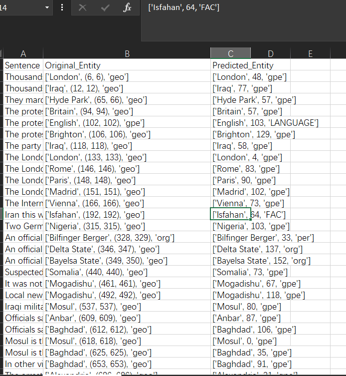

# 实验日志（log1）

## 1. 探究 spaCy 在数据集 0 上准确度低的原因

由于数据集与 spaCy 默认的命名实体标签体系不一致，需要建立一个映射关系（map）来将数据集的实体标签转换为 spaCy 的实体标签。然而，在实际操作中出现以下问题：

1. 数据集仅对 `geo` 和 `gpe` 进行了区分，分别映射到 `LOC` 和 `GPE`。  
2. spaCy 会将某些地理名词识别为 `NORP`（nationality, religion, political group），导致无法与原有标签完美匹配。  

此外，spaCy 输出的实体位置是**字符级**（包含空格和标点），而多数数据集使用的是**基于 token** 的位置，需要额外处理。目前在实验中尚未计算位置准确度。

上图（log1_0.png）展示了使用空白管道时出现的部分错误示例，尤其在 `geo` 和 `gpe` 识别上不够准确。

---

## 2. 探究使用预训练管道结合特定数据集进行微调

为了更好地适配数据集，采用以下策略：

- 从数据集中截取 10,000 行数据，按 0.7 : 0.3 拆分训练集和测试集。  
- 在节省时间的前提下，训练均采用 2 epoch。

### 2.1 使用空白管道进行训练

使用 spaCy 的空白管道训练时，`geo` 与 `gpe` 识别错误率较高，原因在于未能充分利用预训练的先验知识。

上图（log1_1.png）展示了空白管道在地理实体识别中的一些错误案例。

### 2.2 载入预训练管道进行训练

使用 spaCy 官方提供的多种预训练管道，包括 `en_core_web_sm`、`en_core_web_md`、`en_core_web_lg`、`en_core_web_trf` 进行微调。  
其中 `trf`（transformer）管道结果与其他管道差距较大，推测原因如下：

1. `trf` 参数较多，但只训练了 2 epoch，模型未完全收敛。  
2. 训练数据量有限，难以支撑复杂模型的微调需求。  
3. `trf` 输出可能不符合预期规则，需要进一步排查。

上图（log1_2.png）为 `trf` 训练管道在地理实体识别中出现的问题示例。

### 2.3 对微调管道进行更深入的研究

在数据集 1（包含 `PER`、`LOC`、`ORG` 标签）上进行训练与测试，使用原始的 `train.conllu` 和 `test.conllu` 做进一步实验。  
- 短期少量 epoch（2 epoch）下的准确率相对较低。  
- 增加 epoch（如 50 epoch）后准确率有所提升，但仍需平衡训练时间与性能。

---

## 3. 待解决问题

### 3.1 DeepSeek API

- 返回速度过慢，每秒仅生成约 20 个 token，且数据集中每行 tokens 数量不统一，可能出现溢出。  
- API 返回可能出现断行，需要进一步处理；目前采用前十个字符的匹配策略，但仍较慢。

### 3.2 spaCy 训练问题

- `trf` 管道训练时，spaCy 的高度封装导致无法直接调用 `torch` 的 `cuda` 加速，且设备管理不统一。  
- 即使官方文档提供了 GPU 训练方案，实际使用中仍存在问题；若退回 CPU，训练速度过慢。  

上图（log1_3.png）展示了训练过程中的部分日志，反映了 GPU 与 CPU 切换存在的困难。

---

以上是本次实验的主要过程与发现，后续将继续优化管道配置、增加训练数据量、以及排查 GPU 加速和 API 接口调用问题，以提升命名实体识别的准确度与训练效率。
