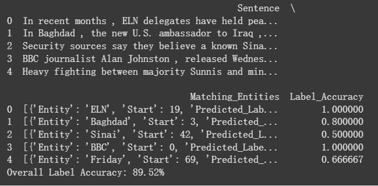
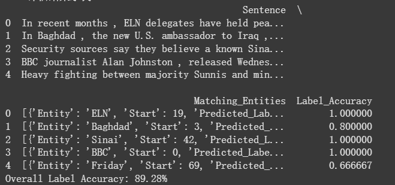
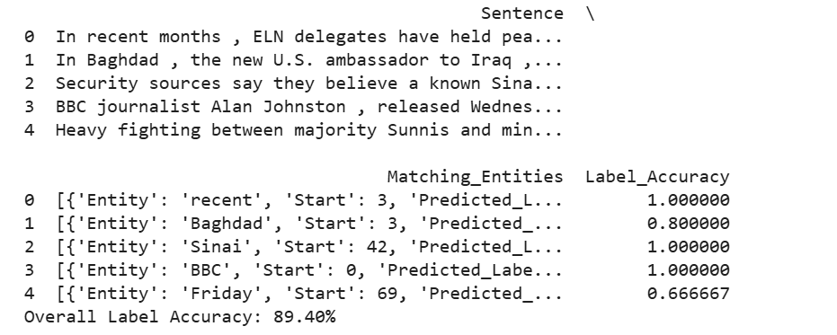
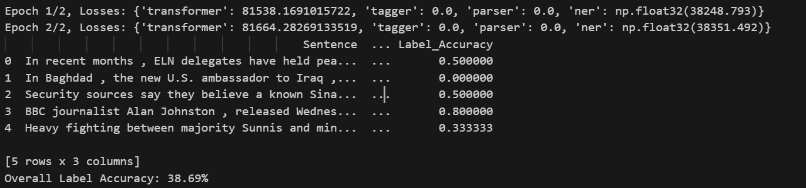
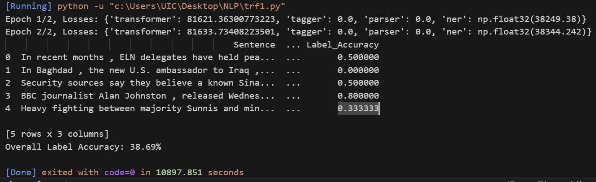
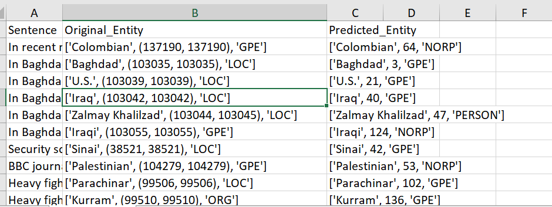
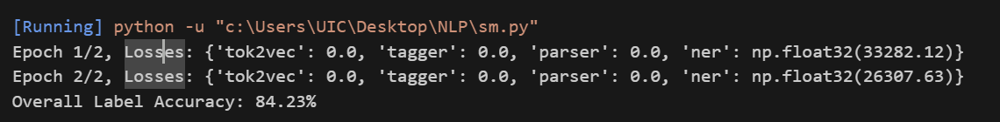
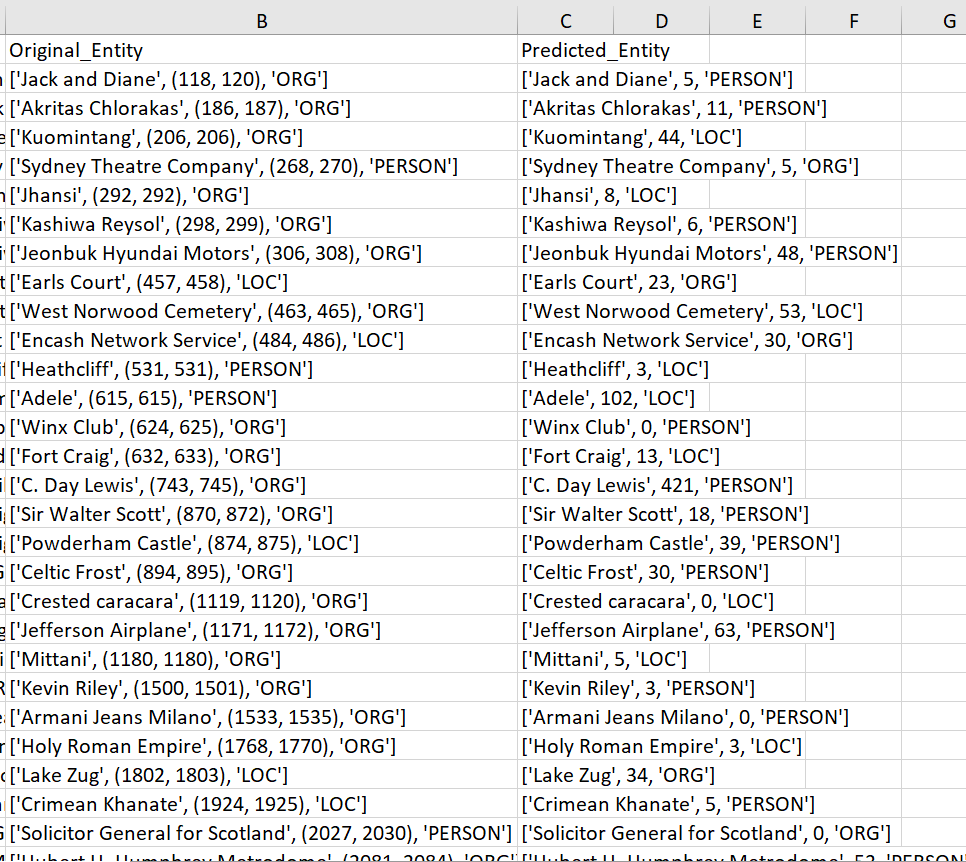
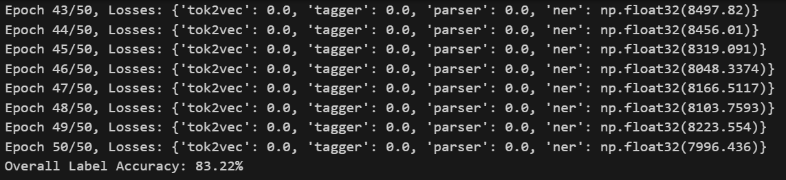
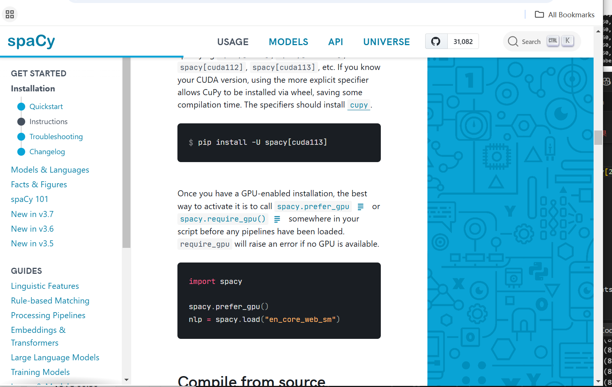

# 实验日志（log1）

## 1. 探究 spaCy 在数据集 0 上准确度低的原因

由于数据集与 spaCy 的标准不一致，需要建立一个 **map**，将数据集的 `entity label` 转换为 spaCy 的 `entity label`。然而，在映射过程中出现了一些问题，例如：

- 数据集仅区分了 `geo` 和 `gpe`，分别可映射到 `LOC` 和 `GPE`。
- 但 spaCy 会将某些地理名词识别为 `NORP`（nationality, religion, political group），导致映射难以统一。

### 1.1 NORP 计入准确度计算（实体加入总样本计数）

### 1.2 NORP 不计入

此外，spaCy 输出的位置是 **字符级**（包括空格和标点），而大部分数据集使用的是 **token 级** 位置，因此需要额外的处理。目前实验中尚未计算位置准确度。

---

## 2. 使用预训练管道结合特定数据集进行微调

### 2.1 数据集处理与训练设定

- **数据集划分**：
  - 截取 **10,000** 行数据，按 **0.7:0.3** 拆分训练集和测试集。
  - 为节省时间，训练采用 **2 epoch**。

### 2.2 使用空白管道进行训练

- 发现 `geo` 和 `gpe` 识别错误率较高。
- **示例错误**：

---

## 3. 载入预训练管道进行训练

分别测试 **spaCy 预训练管道**：

- `en_core_web_sm`

- `en_core_web_md`

- `en_core_web_lg`

- `en_core_web_trf`

### 3.1 结果分析

- `trf` 训练结果与 `sm`、`md`、`lg` 管道相比存在较大偏差。
- 代码基本一致，仅修改 `spacy.load()` 加载不同管道，说明代码错误的可能性较低。
- 可能的影响因素：
  - `trf` 参数过多，但训练 epoch 过少，模型未完全更新。
  - 训练数据量不足，难以支撑 `trf` 复杂模型的微调需求。
  - `trf` 输出可能不符合预期规则。

---

## 4. 微调管道的深入研究

### 4.1 采用数据集 1 进行训练和测试

- 训练集和测试集基于 `train.conllu` 和 `test.conllu` 格式化而成。
- 该数据集的标签仅包括 `PER`、`LOC` 和 `ORG`。

### 4.2 在 `sm` 管道上的训练结果

- **2 epoch 训练准确率：**

- **50 epoch 训练准确率：**

---

## 5. 待解决问题

### 5.1 DeepSeek API 相关问题

- **返回速度过慢**：
  - `tokens` 生成速度仅 **20 tokens/s** 或更低。
  - 数据集每行 `tokens` 数量不统一，可能导致溢出问题。

- **当前处理方式**：
  - 采用较保守的输入策略，导致测试速度较慢。
  - API 返回可能不完整，存在断行现象。
  - 目前采用 **匹配 API 返回 `sentence` 和数据集 `sentence` 的前十个字符** 作为对齐策略，但依然较慢。

---

### 5.2 spaCy 训练问题

- **`trf` 管道的训练封装问题**：
  - 不能直接调用 `torch` 的 `cuda` 加速函数。
  - 训练过程中设备不统一，主要出现在 `spaCy transformer` 管道内部。
  - 由于 `spaCy transformer` 代码封装度高，缺乏公开接口，难以手动修改数据统一至 GPU 训练。

- **GPU 训练加速问题**：
  - spaCy 官方文档提供 GPU 训练方案，但实际使用中未能成功解决。
  - 若退回 CPU，训练速度过慢。

---

### 5.3 训练设备不统一问题

在 `spaCy transformer` 训练过程中，出现 GPU 和 CPU 设备不统一的情况：

- **问题表现**：
  - `spaCy` 在 `trf` 训练时，部分计算仍然发生在 CPU 上，导致训练效率低下。

- **解决方案尝试**：
  - 调用 `spacy.require_gpu()` 强制使用 GPU，但未能成功。

---

## 6. 结论与下一步计划

### 6.1 主要发现
- spaCy 的默认实体映射与数据集标准不匹配，特别是 `NORP` 的处理较为复杂。
- `trf` 训练结果不稳定，推测与训练参数、数据量和 `spaCy` 内部封装有关。
- `DeepSeek API` 速度慢，数据对齐困难，影响实验效率。
- `spaCy transformer` 在 GPU 训练时，设备管理不统一，影响训练速度。

### 6.2 下一步改进方向
1. **调整 `trf` 训练参数**，增加 `epoch` 并扩大训练数据集，以提高模型适配度。
2. **优化 `DeepSeek API` 处理策略**，尝试并行调用 API，或调整输入数据结构以提高处理速度。
3. **进一步研究 spaCy 训练设备的管理问题**，查找可能的 GPU 适配方案，提高训练效率。

---

*本次实验日志记录了 spaCy 训练在数据集上的表现、遇到的问题及改进方向，后续将进一步优化管道配置、调整 `trf` 训练策略，并尝试新的 API 处理方法。*
